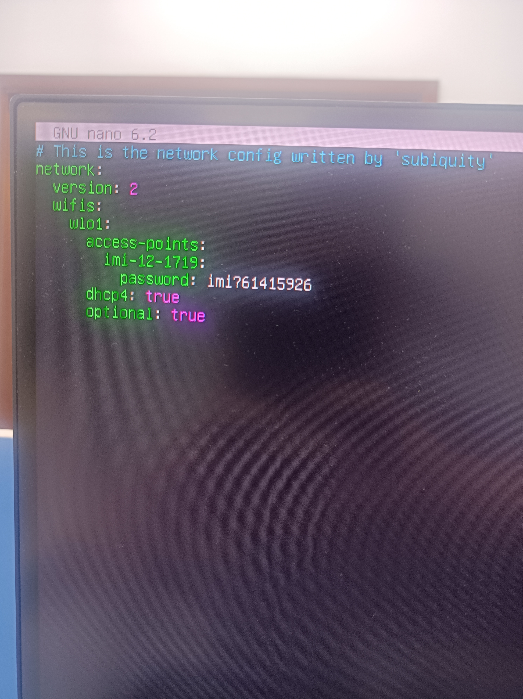

有的问题用sudo解决

在网上查找相关的配置，竟然都是连接一个有密码的WiFi，例如：
配置文件：sudo vim /etc/netplan/下有个.yaml文件


```
network:
    version: 2
    wifis:
        wlan0:
            dhcp4: true
            access-points:
                "your wifi name":
                    password: "your wifi password"
```

但很少有没有密码的WiFi配置，配置如下

```
network:
    version: 2
    wifis:
        wlan0:
            dhcp4: true
            access-points:
                "your wifi name": {}
```

最后

```
sudo netplan generate        --验证一下配置是否正确
 
sudo netplan apply        --应用配置
```



```
网络 imi-12-1719
ssh robot@192.168.1.184

无线网改了，现在是
imi1218-5G
ssh robot@192.168.1.102

可以ping通但是connection refused 重启本机或删除本机主目录上.ssh文件内两文件
```

```shell
sudo apt install alsa-utils

```

配置新版

教程位置

https://edu.gitee.com/usst-imi/projects/470245/repos/usst-imi/somo_voice/tree/centre_voice_xfnewmic


cd upctrl/somo_voice/
source ./install/setup.bash 

安装必要的声卡库：

`sudo apt-get install libasound2-dev`

安装必要的音频播放库：

```
sudo apt-get install sox
sudo apt-get install mplayer
sudo apt-get install sox libsox-fmt-all
sudo apt install pavucontrol
```

安装cJSON


```
cd aiui_readme
sudo rm -r cJSON
apt  install cmake 
sudo apt-get install rar
sudo apt-get install unrar
sudo unrar x cJSON.rar
cd cJSON
sudo mkdir build
cd build/
sudo cmake ..
sudo make
sudo make install 
```


连接新麦克风到电脑,将串口ttyACM0 修改成 wheeltec_mic


```
cd aiui_readme
sudo chmod +x ttyacm0.sh
sudo bash ttyacm0.sh
sudo cp lib* /usr/lib
```

//在libs文件下 ，对应id 对应 lib*文件


```
cd somo_voice/voiceinteraction/libs/x64
sudo cp lib* /usr/lib
```


```
sudo apt-get install python-all-dev  portaudio19-dev

pip install pyaudio
```


文字命令提取


```
pip3 install python-docx
pip install docx 
pip install jieba 
## 扬声器状态所需
sudo apt install pavucontrol
```


pavucontrol
//在录音设别中ALSA plug-in[python3.8] 选择扬声器 ，录音设备可在测试环节ros2 run centre_voice speak_end_record后显示
讯飞麦克风配置
// 编译流程

```
mkdir somo_voice
cd somo_voice
mkdir src
cd src 
git clone https://gitee.com/usst-imi/somo_voice.git -b centre_voice
cd ..
根据aiui_readme/版本说明_老/新版.txt 安装所需插件
colcon build --packages-select somo_msgs
source install/setup.bash
colcon build
```


微软语音合成

```

pip install playsound
pip install azure-cognitiveservices-speech
vim ~/.bashrc 
	# azure 
	export SPEECH_KEY=d38765875***** 在https://portal.azure.com 帐号创建语音服务->密钥 
	export SPEECH_REGION=eastus
```


### 代码

centre_voice 所需话题 ：voice_centre（文本处理中心），speak_end_record (判断语音结束，依据扬声器有无声音)
```
ros2 run centre_voice voice_centre
ros2 run centre_voice speak_end_record
```

voiceinteraction 所需话题 ：aiui_new_mic(新版麦克风启动)
`ros2 run voiceinteraction aiui_new_mic `

azure_ros 所需话题 ： azure_speak(微软语音合成)
`ros2 run azure_ros azure_speak`

words2command 所需话题 ： words2command(文字转命令), servicetest(用于测试时命令接受)

```
ros2 run words2command words2command
ros2 run words2command servicetest
```


整体测试  (开启上述所有功能)

```
ros2 launch centre_voice somovoice1.launch.py
ros2 ros2 run words2command servicetest
ros2 topic echo speak_end //检查语音播放结束是否发送speak_end指令
ros2 topic echo speak_tts //检查交互过程中的所有文字信息
```

#### ros2 run centre_voice voice_centre     

对应文件

somo_voice-centre_voice_xfnewmic/centre_voice/centre_voice/centre_voice.py

创建节点 /voice_centre


```
/voice_centre
  Subscribers:
    /speak_tts: somo_msgs/msg/BtTts
        # 唤醒     语音识别         文字转命令        交互结果  |播报请求 介绍内容请求
        #"awake","speech2words","words2command","words2words","tts","introduction"
        # ros2 topic pub /speak_tts  somo_msgs/msg/BtTts "{type: 'awake', cmd: 你好}" -1
    /tts2speech_succ: std_msgs/msg/Bool
        # 内容为 T/F，若F 则发布  话题 /tts2speech_azure 和 /tts2speech_end  内容为 '语音请求失败'
  Publishers:
    /awake_flag: std_msgs/msg/Bool
        # T/F  唤醒标志
    /tts2command: std_msgs/msg/String
        # 文字转命令
    /tts2speech_azure: std_msgs/msg/String
        # 文字转语音请求
    /tts2speech_end: std_msgs/msg/String
        # # 语音结束检测-扬声器
    /word2words_flag_xf: std_msgs/msg/Bool
    /word2words_xf: std_msgs/msg/String
```

#### ros2 run centre_voice speak_end_record

对应文件

somo_voice-centre_voice_xfnewmic/centre_voice/centre_voice/speakend_record.py

创建节点    /speakend_xf

```
/speakend_xf
  Subscribers:
    /tts2speech_end: std_msgs/msg/String
  Publishers:
    /speak_end: std_msgs/msg/Bool
```


/home/robot/upctrl/somo_voice/src/azure_ros/azure_ros


### 关于扬声器和麦克风
教程  https://cloud.tencent.com/developer/article/1932876
```
cat /proc/asound/cards   # 检查声卡编号
 0 [PCH            ]: HDA-Intel - HDA Intel PCH
                      HDA Intel PCH at 0x603d1a8000 irq 192
 1 [Device         ]: USB-Audio - USB Audio Device
                      C-Media Electronics Inc. USB Audio Device at usb-0000:00:14.0-7.2, full speed
 2 [XFMDPV0018     ]: USB-Audio - XFM-DP-V0.0.18
                      iflytek XFM-DP-V0.0.18 at usb-0000:00:14.0-7.4.1, high speed
```


取消静音
amixer -D pulse sset Master unmute
调音
amixer -D pulse sset Master 5%+


```

pacmd list-sinks  # 查看声卡设备

##此处  可用的音频输出设备（sink），但它似乎是一个空的、虚拟的设备（<auto_null>），而不是实际的声卡设备
1 sink(s) available.
  * index: 0
	name: <auto_null>
	driver: <module-null-sink.c>
	flags: DECIBEL_VOLUME LATENCY DYNAMIC_LATENCY
```

解决办法：


```
sudo pulseaudio --kill        # 终止 PulseAudio 音频服务器。关闭 PulseAudio，停止音频服务。
sudo pulseaudio --start        # 启动 PulseAudio 并使其提供音频服务。
sudo pacmd list-sinks        # 列出 PulseAudio 中可用的音频输出设备，也就是音频输出源。这个命令将显示所有已检测到的音频输出设备以及它们的详细信息
```

音频播放只有sudo才能进行      （加权限解决）
```
ls -l /dev/snd/
sudo chmod a+rw /dev/snd/*
```


命令行调节音量


```
amixer -D pulse sset Master 5%+        # +5%
amixer -D pulse sset Master unmute        # 解除静音

```

alsamixer 是一个用于控制 ALSA（Advanced Linux Sound Architecture）音频系统的命令行工具。

运行 alsamixer 命令时遇到问题，可能是由于声卡驱动未正确加载、配置错误或其他音频相关的问题导致的。


alsamixer


录音
播音    aplay  xitongqidong.wav


```
arecord -d 10 test.wav
#正在录音 WAVE 'test.wav' : Unsigned 8 bit, 频率8000Hz， Mono
```


```
aplay test.wav
#正在播放 WAVE 'test.wav' : Unsigned 8 bit, 频率8000Hz， Mono
```

alsamixer是Linux音频框架ALSA工具之一，用于配置音频各个参数;
alsamixer是基于文本图形界面的，可以在终端中显示.通过键盘的上下键，左右键等实现音量设置，开关操作等。

amixer，是alsamixer的文本模式,即命令行模式，以命令行的形式去配置声卡的各个选项，比如选择音频输入通道是Mic输入，还是Line输入。


```
amixer -h     # 查看用法
amixer controls    # 用于查看音频系统提供的操作接口
amixer contents     # 用于查看接口配置参数
```


sudo aplay -l 命令，列出了系统中的播放设备（声卡和音频设备）


```
sudo arecord -l        # 查看录音设备    列出123....
```

```
sudo arecord -l
**** List of CAPTURE Hardware Devices ****
card 0: PCH [HDA Intel PCH], device 0: ALC269VB Analog [ALC269VB Analog]
  Subdevices: 1/1
  Subdevice #0: subdevice #0
card 1: XFMDPV0018 [XFM-DP-V0.0.18], device 0: USB Audio [USB Audio]
  Subdevices: 1/1
  Subdevice #0: subdevice #0
card 2: Device [Usb Audio Device], device 0: USB Audio [USB Audio]
  Subdevices: 1/1
  Subdevice #0: subdevice #0
```


```
arecord -D hw:1 -f S16_LE -r 44100 -d 3 test.wav  # hw   0,1,2....全试试   录音  这里是使用1录音3s
```

```

vim /etc/asound.conf

defaults.ctl.card 1
defaults.pcm.card 1
defaults.timer.card 1
```

#### error0         配置发音

```shell
sudo apt-get install libasound2-dev  #安装必要的声卡库
```


安装必要的音频播放库：

```shell
sudo apt-get install sox
sudo apt-get install mplayer
sudo apt-get install sox libsox-fmt-all
sudo apt install pavucontrol
sudo apt-get install python-all-dev  portaudio19-dev
pip install pyaudio
pip3 install python-docx
pip install docx 
pip install jieba 
## 扬声器状态所需
sudo apt install pavucontrol
sudo apt install alsa-utils
```


##### error1          fatal error: alsa/asoundlib.h: No such file or directory   #include <alsa/asoundlib.h>


```shell
# 5 | #include <alsa/asoundlib.h>
#      |          ^~~~~~~~~~~~~~~~~~
#compilation terminated.
#gmake[2]: *** [CMakeFiles/aiui_interaction.dir/build.make:132: CMakeFiles/aiui_interaction.dir/src/AudioPlayer.cpp.o] Error 1
#gmake[2]: *** Waiting for unfinished jobs....
#ChatGPT

#解决办法：
sudo apt-get install libasound2-dev
```

##### error2

```
Could not import the PyAudio C module 'pyaudio._portaudio'.

解决办法：
sudo apt-get install python3-pyaudio
```


##### error3  # 一段声音只有 sudo 播放才有声音，不用 sudo 播放没有声音


一段声音只有 sudo 播放才有声音，不用 sudo 播放没有声音

```
export AUDIODRIVER=alsa              
```

```
sudo usermod -aG audio  root       
```

```                           
pulseaudio --start
```

##### error4      No CMAKE_CXX_COMPILER could be found.

链接
```
https://blog.csdn.net/weixin_44120025/article/details/118769262
```

```shell
# 原因是没有安装gcc和g++编译环境
sudo apt-get install build-essential
```

##### error5         fatal error: alsa/asoundlib.h: No such file or directory   #include <alsa/asoundlib.h>


### 2023/11/03   配置nuc

```shell
ros2 run vits vits_tts                           # 语音
ros2 run ulaahead facial_features                # 16舵机
ros2 run ulaahead facial_eye_head_blink          # 随机动作
```
#### 随机表情部分

随机生成眨眼、转头

代码结构
```shell
# /home/imi-head/renahead/src/ulaahead
├── doc
│   ├── facial_expression.md
│   ├── facial_features.md
│   ├── facial_mouth.md
│   └── servoInfo.txt
├── launch
├── package.xml
├── resource
│   └── ulaahead
├── setup.cfg
├── setup.py
├── test
│   ├── test_copyright.py
│   ├── test_flake8.py
│   └── test_pep257.py
└── ulaahead
    ├── action_eye_head_blink.py        # 发布随机眼球动作和头部动作
    ├── __init__.py
    ├── robot_control.py                # 发布16舵机角度指令
    └── servo_control.py                # 被robot_control.py调用直接控制舵机
```


```shell
# # 发布随机眼球动作和头部动作
ros2 run ulaahead facial_eye_head_blink       #"facial_eye_head_blink = ulaahead.action_eye_head_blink:main"
#/my_publisher
#  Subscribers:
#  Publishers:
#    /face_action: std_msgs/msg/String        # 字符串指令 （eg：   data: 单次眨眼）
#    /robot_state: user_interfaces/msg/Servo  # 直接让某电机在某时间完成某角度转动的指令 
```


```shell
# 发布16舵机角度指令并发出
ros2 run ulaahead facial_features             # 'facial_features = ulaahead.robot_control:main'
#/facial_features
#  Subscribers:
#    /robot_state: user_interfaces/msg/Servo  # 直接让某电机在某时间完成某角度转动的指令 
#  Publishers:
```

#### 语音播报部分

```shell
# 安装conda
# VITS  Python 3.10
conda create -n VITS python=3.10

# requirements.txt  在文件 /home/imi-head/renahead/src/vits/vits   下
pip install -r requirements.txt -i https://pypi.tuna.tsinghua.edu.cn/simple
# 将文件中从conda导包的路径替换成为我们自己建的包    # 搜索'/lib/python3.10/site-packages'
pip uninstall em    # 系统环境em 包和empy包同时存在会冲突
```


```shell
# **_error1_** :
#from numba.core.typeconv import _typeconv
#ImportError: cannot import name '_typeconv' from 'numba.core.typeconv' 
# 解决办法
sudo pip install llvmlite==0.31.0
sudo -H pip install numba

error2：
# 找不到voice_msg的audiodata
# 解决办法 ： 重启试试

error3：
# # 测试许多模型加载路径均是绝对路径，部署到别的地方时找一下
```


```shell
# 验证本模块
ros2 run vits vits_tts
ros2 topic pub /llm_response_result std_msgs/msg/String {"data: '你好'"} -1
# 此时播报声音
# renahead/src/vits/vits/related_funtion/output   目录下有新的语音
```

```shell
ros2 run vits vits_tts
#/tts_node
#  Subscribers:
#    /llm_response_result: std_msgs/msg/String    # 需要播报的文字，可以是大模型的回复
#  Publishers:
#    /tts_mouth_data: voice_msgs/msg/Audiodata    # 语音数据流
```

##### 关于 交互flag

```shell
#启动交互flag"
ros2 run llm ros_llm
# 对应setup里面的     ros_llm = llm.api_use:main
```


```shell
# error
#File "/opt/ros/foxy/lib/python3.8/site-packages/rosidl_adapter/resource/__init__.py", line 19, in <module>
#      import em
#ModuleNotFoundError: No module named 'em'
# 解决办法
pip uninstall em  # 系统环境运行该指令         # 系统环境em 包和empy包同时存在会冲突
# 删除编译好的包重新编译  编译指令顺序如下
colcon build --packages-select user_interfaces
colcon build
```


#### 部署kaldi

主要文件 
1. renahead目录下our_data
2. renahead/src目录下llm
3. renahead/src目录下snowboyros
4. renahead/src目录下VoiceOffline


```shell
# 以下是最终运行命令
#启动交互flag"
ros2 run llm ros_llm
#启动交互问答"
ros2 launch VoiceOffline voice_function.launch.py
# 再启动大模型就可以实现问答了
```

```shell
ros2 launch VoiceOffline voice_function.launch.py   # 启动语音交互
# 文件位置是  /src/VoiceOffline/launch/voice_function.launch.py
# 该文件等价于启动三个节点
#    ros2 launch VoiceOffline kaldi.launch.py     # 语音转文字
#    ros2 launch snowboyros  snowboy.launch.py         #snowboy    这个会有报错
#    ros2 launch vits vits.launch.py   # 等价于指令    ros2 run vits vits_tts   该指令前面已经介绍
```


##### 语音转文字
```shell
# ros2 launch VoiceOffline kaldi.launch.py 
#路径为src/VoiceOffline/launch 等价于运行指令
ros2 run VoiceOffline ros_kaldi
# 该指令对应文件  src/VoiceOffline/VoiceOffline/ros_kaldi.py
```


```shell
# src/VoiceOffline/VoiceOffline/ros_kaldi.py   编译前改变路径   40行左右   对应同级目录的  sherpa-ncnn-conv-emformer-transducer-2022-12-06 文件夹
        tokens="/home/ros/kaldi_vits_glm/src/VoiceOffline/VoiceOffline/sherpa-ncnn-conv-emformer-transducer-2022-12-06/tokens.txt",
        encoder_param="/home/ros/kaldi_vits_glm/src/VoiceOffline/VoiceOffline/sherpa-ncnn-conv-emformer-transducer-2022-12-06/encoder_jit_trace-pnnx.ncnn.param",
        encoder_bin="/home/ros/kaldi_vits_glm/src/VoiceOffline/VoiceOffline/sherpa-ncnn-conv-emformer-transducer-2022-12-06/encoder_jit_trace-pnnx.ncnn.bin",
        decoder_param="/home/ros/kaldi_vits_glm/src/VoiceOffline/VoiceOffline/sherpa-ncnn-conv-emformer-transducer-2022-12-06/decoder_jit_trace-pnnx.ncnn.param",
        decoder_bin="/home/ros/kaldi_vits_glm/src/VoiceOffline/VoiceOffline/sherpa-ncnn-conv-emformer-transducer-2022-12-06/decoder_jit_trace-pnnx.ncnn.bin",
        joiner_param="/home/ros/kaldi_vits_glm/src/VoiceOffline/VoiceOffline/sherpa-ncnn-conv-emformer-transducer-2022-12-06/joiner_jit_trace-pnnx.ncnn.param",
        joiner_bin="/home/ros/kaldi_vits_glm/src/VoiceOffline/VoiceOffline/sherpa-ncnn-conv-emformer-transducer-2022-12-06/joiner_jit_trace-pnnx.ncnn.bin",
```


```shell
ros2 run VoiceOffline ros_kaldi  # 编译后运行该指令
```


```shell
# error1：
    #ModuleNotFoundError: No module named 'xpinyin'
    #imi-head@imihead-MINIPC-PN64:~/renahead$ pip install xpinyin
pip install xpinyin # 解决办法
```


```shell
# error2 ：
    # Please install sounddevice first.
pip install sounddevice  # 解决办法
```


```shell
# error3
#File "/home/imi-head/renahead/install/VoiceOffline/lib/VoiceOffline/kaldi_python.py", line 31, in <module>
#    import sherpa_ncnn
#ModuleNotFoundError: No module named 'sherpa_ncnn'
 pip install sherpa-ncnn -i https://pypi.tuna.tsinghua.edu.cn/simple   # 解决办法
```

##### snowboyros  文件

```shell
# 运行指令
ros2 launch snowboyros  snowboy.launch.py   
```
```shell
# # 等价于节点  
ros2 run snowboyros snowboyros
# "snowboyros=snowboyros.snowboyros_py:main"
# 对应文件  src/snowboyros/snowboyros/snowboyros_py.py
```

```shell
# error 1
# ImportError: libcblas.so.3: cannot open shared object file: No such file or directory
sudo apt install libatlas-base-dev
```

```shell
# error 2
#import pygame
#ModuleNotFoundError: No module named 'pygame'
pip install pygame  -i https://pypi.tuna.tsinghua.edu.cn/simple 
```

```shell
# 关于唤醒
# 接收到speech2tts_kaldi_call话题才会录音
# speech2tts_kaldi_call由 src/snowboyros/snowboyros/snowboyros_py.py文件的编译发布


#src/snowboyros/snowboyros/snowboydecoder.py的HotwordDetector类是关于唤醒的：
#    Snowboy解码器检测“decoder_model”指定的关键字`
#    存在于麦克风输入流中。
#    ：param decoder_model：解码器模型文件路径、字符串或字符串列表
#    ：param resource：资源文件路径。
#    ：param sensitivity：解码器灵敏度，浮点值列表的浮点值。值越大，解码器就越灵敏。如果提供了一个空列表，则将使用模型中的默认灵敏度。
#    ：param audio_gain：将输入音量乘以此因子。
#    ：param apply_foronend：如果为True，则应用前端处理算法。


#改变文件/pmdl/ruina.pmdl即可修改唤醒词，该文件由网站 https://snowboy.kitt.ai/ 生成
#或者网站https://snowboy.hahack.com/
```


### 开机自启

链接 
```
https://www.codenong.com/cs109199281/
```
添加开机启动终端


> 1.终端中输入gnome-session-properties打开Ubuntu开机首选项管理

> 2.点击“添加”按钮，名称和注释随便填写，命令里填写：`gnome-terminal`(替换为自己的指令)，点击“添加”。


### 配置glm3


pip install --upgrade fastapi -i https://pypi.tuna.tsinghua.edu.cn/simple


