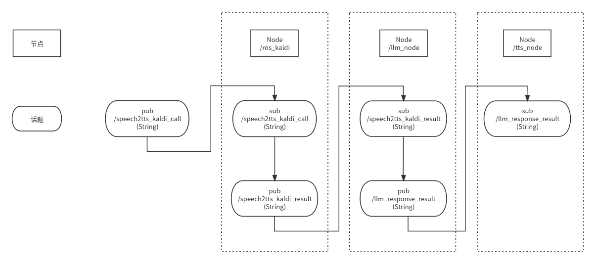

位置 /media/ros/1T/yongtong/sts
另一个位置  /home/ros/kaldi_vits_glm
原本readme


```
在部署语音识别包时，即运行ros2 run VoiceOffline ros_kaldi
会出现  File "/media/ros/1T/yongtong/sts/install/VoiceOffline/lib/python3.10/site-packages/VoiceOffline/ros_kaldi.py", line 10, in <module>
    from kaldi_python import SherpaNcnn
ModuleNotFoundError: No module named 'kaldi_python'
解决方案：我们把kaldi_python.py放入上述报错的文件夹中即可。无需colcon build，可直接运行

在演示时，需要在sts文件夹下打开终端。
开启五个终端
终端1：ros2 topic pub /speech2tts_kaldi_call std_msgs/msg/String {"data: ''"} -1           # 启动语音识别指令
终端2：ros2 run VoiceOffline ros_kaldi                                                     # 语音识别节点
终端3：ros2 run llm ros_llm                                                                # 调用chatGLM的use_api节点
终端4：ros2 run vits vits_tts                                                              # 语音合成节点
终端5：ros2 topic echo /llm_response_result                                                # 查看回复的对话 内容               
另外，需要在 /media/ros/1T/yongtong/sts/src/llm/llm 中，打开终端，运行python openai_api.py，启动chatGLM的节点。


/media/ros/1T/yongtong/sts
```

主要是三个部分


```
终端2：ros2 run VoiceOffline ros_kaldi                                                     # 语音识别节点
终端3：ros2 run llm ros_llm                                                                # 调用chatGLM的use_api节点
终端4：ros2 run vits vits_tts                                                              # 语音合成节点


```

#### 终端2：ros2 run VoiceOffline ros_kaldi    # 语音识别节点
启动节点 /ros_kaldi


```
/ros_kaldi
  Subscribers:
    /speech2tts_kaldi_call: std_msgs/msg/String
  Publishers:
    /speech2tts_kaldi_result: std_msgs/msg/String
```

#### 终端3：ros2 run llm ros_llm 

```
启动节点   /llm_node
/llm_node
  Subscribers:
    /speech2tts_kaldi_result: std_msgs/msg/String
  Publishers:
    /llm_response_result: std_msgs/msg/String
```


#### 终端4：ros2 run vits vits_tts                                                              # 语音合成节点

启动节点   /tts_node
```
/tts_node
  Subscribers:
    /llm_response_result: std_msgs/msg/String
```



### 位置0830文件

路径    /media/ros/1T/sk/llama_ws

运行代码  ros2 run llm2_test llm_test

setup.py文件中有            "llm_test = llm2_test.llm2_main:main"

这个代码对应    /llama_ws/src/llm2_test/llm2_main.py

这个代码创建节点    /llm_main

```

/llm_main
  Subscribers:
    /paper_det: std_msgs/msg/Bool                        # 纸张是否存在，存在写字，不存在只回答
    /speech2tts_kaldi_result: std_msgs/msg/String        # 语音转文字结果，输入大模型
  Publishers:
    /llm_response_result: std_msgs/msg/String            # 输入大模型后的文字回答
```

eg： 直接话题发布一个问题    ros2 topic pub /speech2tts_kaldi_result std_msgs/msg/String {"data: '你好'"} -1 

改动后的

```
conda activate llama2_demo
/llama_ws/src/llm2_test
 python3 db_build.py
```


#### 大主机演示

开启问答大模型

```shell
cd /home/ros/kaldi_vits_glm/src/llm/llm
 conda activate chatGLM
python openai_api.py             # 加载完毕才可以执行下面代码
#####上面是chatglm大模型，相对的，我们可以开启llma大模型
cd /media/ros/1T/sk/llama_ws
ros2 run llm2_test llm_test 
```


开启语音相关


```shell
cd /home/ros/kaldi_vits_glm
 source install/setup.bash
ros2 launch VoiceOffline voice_function.launch.py   # 启动语音交互
# [snowboyros-1] [INFO] [1693572110.684595386] [snowboyros]: start_record  这一行出现之后才可以说话
 source install/setup.bash
ros2 run llm ros_llm   #启动交互flag

ros2 topic echo /llm_response_result   # 查看回答
```


启动表情

```
cd /home/ros/kaldi_vits_glm/src/head-control
 source install/setup.bash
ros2 run ulaahead facial_features 

ros2 run ulaahead facial_mouth_audio            # 说话表情演示
```

### 20231010   测试

窗口1
```shell
cd /home/ros/kaldi_vits_glm/src/llm/llm
conda activate chatGLM
python openai_api.py             # 加载完毕才可以执行下面代码
```

窗口2和3
```shell
cd /home/ros/kaldi_vits_glm
ros2 launch VoiceOffline voice_function.launch.py   # 启动语音交互
ros2 run vits vits_tts 
```


#### 解决报错 `source: not found`
sh文件中写入指令 `source install/setup.bash` 出现此报错
解决办法参考网站  https://blog.csdn.net/buynow123/article/details/51774018

测试：
运行 `ls -l /bin/sh`  后显示`/bin/sh -> dash`
这说明是用dash来进行解析的。

解决方案：
命令行执行：`dpkg-reconfigure dash`（需要root权限）
在界面中选择no
再运行`ls -l /bin/sh` 后显示`/bin/sh -> bash`


### 20231016   测试


```shell
cd /media/ros/1T/sk/llama_ws
conda activate sk
ros2 run llm2_test llm_test 

cd kaldi_vits_glm 
ros2 launch VoiceOffline voice_function.launch.py   # 启动语音交互

/home/ros/kaldi_vits_glm/src/head-control
ros2 run ulaahead facial_mouth_audio
```


###  **_1023 测试  可以运行的_** 
对话系统和图片转文字同时启动

#### 对话系统部分

```shell
cd /home/ros/kaldi_vits_glm/src/llm/llm
conda activate chatGLM
python openai_api.py             # 加载完毕才可以执行下面代码      对话大语言模型
```

```shell
cd /home/ros/kaldi_vits_glm
source install/setup.bash
ros2 launch VoiceOffline voice_function.launch.py   # 启动语音交互
```

```shell
cd /home/ros/kaldi_vits_glm
source install/setup.bash
ros2 run llm ros_llm        # 语音交互flag
```


```shell
cd /home/ros/kaldi_vits_glm/src/head-control
source install/setup.bash
ros2 run ulaahead facial_mouth_audio        #  启动嘴部动作
```

```shell
cd /home/ros/kaldi_vits_glm/src/head-control
source install/setup.bash
ros2 run ulaahead facial_features  # 启动电机角度发布
```

#### 图像部分
```shell
cd /media/ros/1T/yongtong/nlp/demo_ros_02_visualglm_vits
conda activate chatGLM
python api_hf_1018.py    #启动大模型
```


```shell
#cd /home/ros/kaldi_vits_glm
#source install/setup.bash
#ros2 run vits vits_tts  # 这个和对话系统重复了
ros2 topic echo /llm_response_result  # #启动语音播报
```


```shell
cd /media/ros/1T/yongtong/nlp/demo_ros_03_photo_vits
source install/setup.bash
ros2 run video_pub video_pub1  # #启动视频发布
```


```shell
cd /media/ros/1T/yongtong/nlp/demo_ros_03_photo_vits
source install/setup.bash
ros2 run video_pub photograph_pub    #截图，请求文字回复并发布
```

#### 串口usb

```shell
sudo ln -s /dev/ttyUSB1 /dev/ttyUSB0  # 将/dev/ttyUSB1  映射  /dev/ttyUSB0
sudo rm /dev/ttyUSB0        # 删除错误映射
```


### 1026  测试


```shell
ros2 launch VoiceOffline voice_function.launch.py   # 启动语音交互
# 文件位置是  kaldi_vits_glm/src/VoiceOffline/launch/voice_function.launch.py
# 该文件等价于启动三个节点
#    ros2 launch snowboyros  snowboy.launch.py         # 这个会有报错
#    ros2 launch VoiceOffline kaldi.launch.py 
#    ros2 launch vits vits.launch.py 
```

```shell
ros2 launch snowboyros  snowboy.launch.py
# 对应节点  ros2 run snowboyros snowboyros
```

kaldi_vits_glm/src/snowboyros/snowboyros/snowboyros_py.py   文件约34-49行加入收到唤醒后提示音播放模块，这个模块可以注释


###  1027测试      融合了图文对话和原本对话系统


```shell
# 启动visual_glm大模型
cd /media/ros/1T/yongtong/nlp/demo_ros_02_visualglm_vits
conda activate chatGLM
python api_hf_1018.py    #启动大模型
```


```shell
cd /media/ros/1T/yongtong/nlp/kaldi_vits_glm
source install/setup.bash
ros2 launch VoiceOffline voice_function.launch.py   # 启动语音交互
```


```shell
cd /media/ros/1T/yongtong/nlp/kaldi_vits_glm
source install/setup.bash
ros2 run llm ros_llm        # 语音交互flag
```

```shell
cd /media/ros/1T/yongtong/nlp/kaldi_vits_glm
source install/setup.bash
ros2 run llm  ros_llm1   # 这是图片对话系统，与  python openai_api.py 指令 功能重叠，只启动一个
```


```shell
cd /media/ros/1T/yongtong/nlp/demo_ros_03_photo_vits
source install/setup.bash
ros2 run video_pub video_pub1  # #启动视频发布
```


###  1129测试      接入chatglm3和langchain

运行glm3问答系统

```shell
cd /media/ros/1T/yongtong/nlp/kaldi_vits_glm
source install/setup.bash
ros2 run glm3_langchain glm3_langchain   # 创建节点  glm3_langchain
```

```shell
# 测试
ros2 node info /glm3_langchain
#/glm3_langchain
#  Subscribers:
#    /llm_response_result: std_msgs/msg/String
#  Publishers:
#    /speech2tts_kaldi_result: std_msgs/msg/String

ros2 topic pub /llm_response_result std_msgs/msg/String '{"data": "你从哪里来"}' -1
```


```shell
#ros2文件路径
#/media/ros/1T/yongtong/nlp/kaldi_vits_glm/src/glm3_langchain/glm3_langchain/glm3_langchain.py

#检索文档路径
# /media/ros/1T/yongtong/nlp/kaldi_vits_glm/our_data/usst.py

# 大模型路径
# /media/ros/1T001/yongtong/nlp/demo_18_glm3/data/chatglm3-6b

# langchain路径
# /media/ros/1T001/yongtong/nlp/demo_18_glm3/data/chain/text2vec-large-chinese

# 环境路径
# /media/ros/1T/djw/envs/chatGLM/lib/python3.10/site-packages
```


###  1212测试      接入chatglm3和langchain

cd /media/ros/1T/yongtong/nlp/kaldi_vits_glm

ros2 run snowboyros snowboyros # 唤醒

ros2 run VoiceOffline ros_kaldi     # 识别

ros2 run vits vits_tts 


